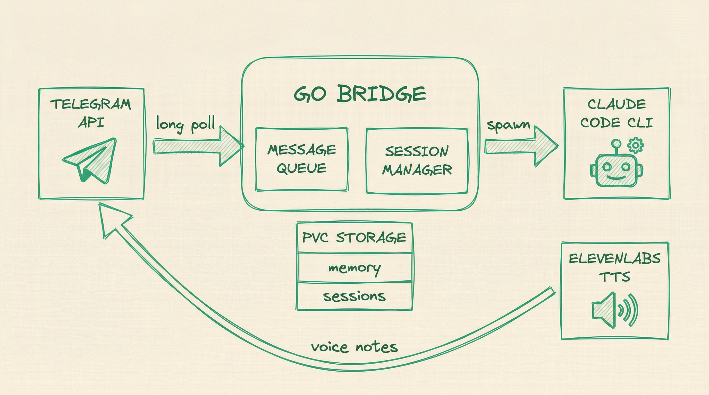

# PAI Bridge



Telegram bridge for [Claude Code](https://docs.anthropic.com/en/docs/claude-code), deployed as a container on Kubernetes. Talk to Claude from your phone.

## Architecture

- **Runtime**: Go binary that long-polls Telegram and spawns `claude -p` subprocesses
- **Container**: Multi-stage Docker build (Go compilation + Ubuntu base with Claude CLI)
- **Orchestration**: Kubernetes (any cluster) or standalone Docker
- **Storage**: PersistentVolumeClaim for sessions, memory, skills, and projects
- **Voice**: ElevenLabs TTS -> OGG/OPUS -> Telegram voice notes (optional)
- **Auth**: Claude subscription via OAuth token (no metered API billing)

## How It Works

The bridge is a lightweight Go binary (~10MB) that:
1. Long-polls Telegram for messages
2. Spawns `claude -p` subprocesses per session
3. Streams responses back to Telegram with HTML formatting
4. Manages conversation sessions with `--resume`
5. Logs conversations, generates summaries, and injects prior context into new sessions
6. Synthesizes voice responses via ElevenLabs when Claude outputs `VOICE:` directives

Claude Code runs against your subscription (Pro/Max), not metered API.

### Personal AI Infrastructure

This project builds on [Daniel Miessler's Personal AI Infrastructure](https://github.com/danielmiessler/Personal_AI_Infrastructure) (PAI), which provides the skill system, agent definitions, hooks, and memory architecture that Claude Code uses. PAI is installed on the persistent volume and managed by the agent itself across sessions.

### Message Queue

When a message arrives while Claude is already processing, the bridge queues it instead of spawning a second subprocess. Multiple queued messages are batched into a single follow-up prompt once the active response is delivered. Queue depth is capped at 20 messages.

## Memory System

The bridge implements multi-layer memory for session continuity:

```
/mnt/pai-data/memory/
  conversations/{userID}/{sessionID}.jsonl   # Every turn logged
  summaries/{userID}/{date}-{sessionID}.md   # Claude-generated session summaries
  daily/{userID}/{YYYY-MM-DD}.md             # Daily append-only notes
```

- **Conversation logging** -- every message exchange is written to JSONL on the persistent volume
- **Pre-death flush** -- when sessions timeout, get `/clear`ed, or the bridge shuts down, Claude summarizes the conversation into a durable markdown file
- **Cross-session context** -- new sessions load the last 5 summaries + today's/yesterday's daily notes, so Claude knows what happened before
- **Daily reset** -- sessions reset at 4 AM (configurable) instead of short idle timeouts

## Voice Notes

The bridge supports text-to-speech via ElevenLabs, delivered as Telegram voice notes with inline playback.

1. Claude includes a voice line (`VOICE: Hello!` or via PAI Algorithm voice curls)
2. The bridge extracts the voice line and strips it from the visible text
3. Calls ElevenLabs TTS API -> receives MP3 audio
4. Converts MP3 -> OGG/OPUS via `ffmpeg` (included in container image)
5. Sends via Telegram `sendVoice` API -> user hears the voice note inline

Voice is configured in `settings.json` under `telegramBridge.voice`. If the API key is missing or voice is disabled, the bridge silently skips voice synthesis.

## Prerequisites

- A Claude Code subscription (Pro or Max)
- A Telegram bot token (from [@BotFather](https://t.me/botfather))
- A container registry (Docker Hub, GHCR, ECR, etc.)
- A Kubernetes cluster (or Docker for standalone)
- (Optional) ElevenLabs API key for voice
- (Optional) PostgreSQL database for Ralph task management

## Container Image

The image is built via multi-stage Dockerfile:

```dockerfile
# Stage 1: Build Go binary
FROM golang:1.23-alpine AS builder
# ... compiles bridge-go/ to static binary

# Stage 2: Ubuntu base with Claude CLI + bridge
FROM ubuntu:24.04
# Adds: system deps, claude user, Claude CLI, bridge binary, entrypoint
```

The entrypoint (`k8s/entrypoint.sh`) handles:
- PVC directory structure creation
- Symlinking `/home/claude/.claude` -> PVC for persistent config/data
- Merging ConfigMap base settings with PVC settings via `jq`
- Injecting secrets from environment variables into `settings.json`

## Deployment

### Kubernetes

1. Build and push the container image to your registry
2. Create a namespace and deploy the manifests (Deployment, Service, PVC, ConfigMap)
3. Create a Kubernetes Secret with the required keys (see below)
4. The bridge runs as a single replica (`Recreate` strategy -- only one Telegram poller per bot token)

### Secrets

Create a Kubernetes Secret with these keys:

| Key | Description |
|-----|-------------|
| `claude-oauth-token` | Claude Code OAuth token (`claude setup-token`) |
| `telegram-bot-token` | Telegram bot token from @BotFather |
| `telegram-allowed-users` | Comma-separated Telegram user IDs |
| `elevenlabs-api-key` | ElevenLabs API key for TTS (optional) |
| `database-url` | PostgreSQL connection string for Ralph (optional) |

## CI/CD

### Build Image (`build-k8s.yml`)

Builds and pushes the container image on pushes to main that touch `bridge-go/`, `k8s/`, or `Dockerfile.k8s`. Configure the workflow with your own registry credentials.

### Tests (`test.yml`)

Runs `go test` with race detection on pushes and PRs that touch `bridge-go/`.

## Telegram Bot Commands

| Command | Description |
|---------|-------------|
| `/start` | Show bridge info |
| `/status` | Current session status |
| `/clear` | End current session |

### Supported Input

- **Text messages** -- regular chat
- **Photos** -- image analysis
- **PDFs** -- document analysis
- **Text files** -- code, markdown, CSV, JSON, etc.

### Bridge Directives

| Directive | Effect |
|-----------|--------|
| `SEND: /path/to/file` | Bridge delivers the file to the Telegram chat |
| `VOICE: Text to speak` | Bridge synthesizes speech via ElevenLabs |

## Configuration

The bridge reads its configuration from `settings.json` (under `telegramBridge`):

```json
{
  "telegramBridge": {
    "enabled": true,
    "allowed_users": ["YOUR_TELEGRAM_USER_ID"],
    "sessions": {
      "timeout_minutes": 240,
      "max_concurrent": 2,
      "default_work_dir": "~/projects",
      "default_model": "claude-sonnet-4-5-20250929",
      "reset_hour": 4,
      "timezone": "America/New_York"
    },
    "voice": {
      "enabled": false,
      "voice_id": "YOUR_ELEVENLABS_VOICE_ID",
      "model": "eleven_turbo_v2_5"
    }
  }
}
```

## Local Development

```bash
cd bridge-go
go build -o pai-bridge .
go test ./...
go vet ./...
```

## License

See [LICENSE](LICENSE).
